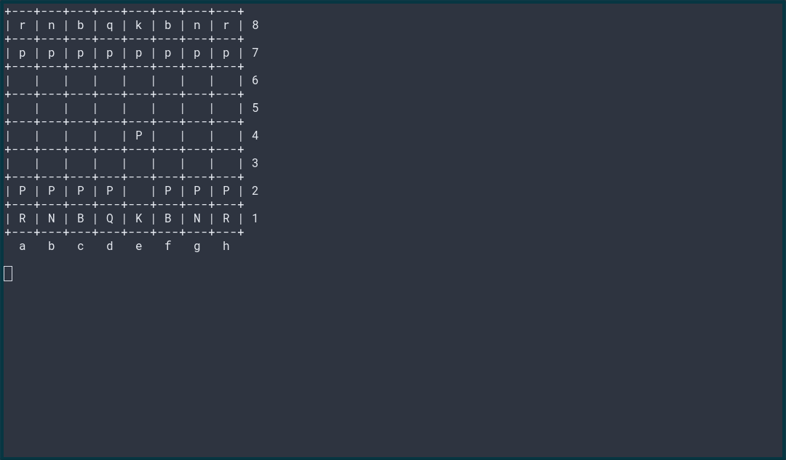

## Install Python dependencies

```pip install openai chess stockfish```

## Install Stockfish

On Debian/APT-based Linux distributions:
```apt install stockfish```

On macOS with Homebrew:
```brew install stockfish```

## Run Chess experiment

```
export OPENAI_KEY=<your-openai-API-key>
./checkmate-openai.py
```
or

```
export ANTHROPIC_KEY=<your-anthropic-API-key>
./checkmate-claude.py
```

Some statistics of about 100 games between Claude 3.5 Sonnet and Stockfish 1700 ELO are in output-claude.log, and between GPT-4-Turbo and Stockfish 1700 in output-gpt.log.

Essentially, Claude lost 1% of the games by checkmate, the other 99% were ended because of an illegal move by Claude - after 10.6 moves on average.

6.25% of games between GPT-4-Turbo and Stockfish 1700 ended in a Stockfish victory due to checkmate. The other 95.75% ended in an illegal move by GPT-4-Turbo after 19.5 moves on average.



